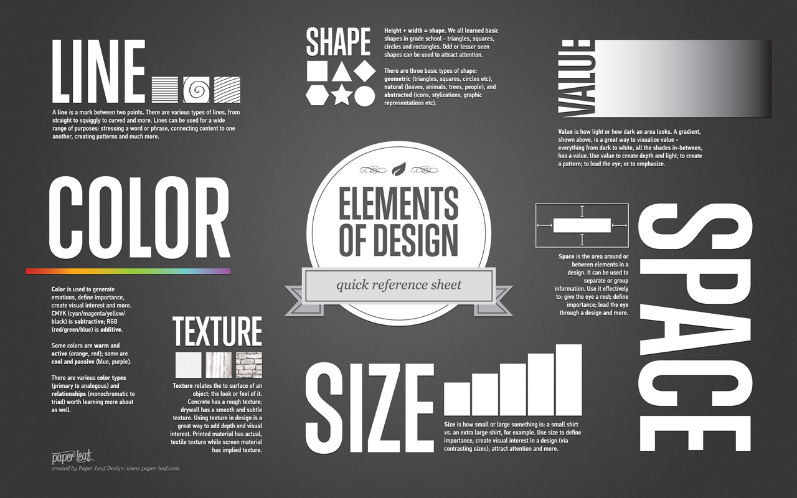

# Data visualization

A handout by [Casey Dunn](http://dunnlab.org)

## What is data visualization?

Data visualization is the mapping of *data attributes* to *aesthetic attributes*.

### Data attributes

Data attributes are direct properties of the data or summaries of the data. *Statistical principals* provide our language for summarizing data. Data attributes can include:

- Magnitude
- Category
- Mean
- Variance
- Median
- Density
- Regression lines

Data visualizations often include both raw data properties (e.g., a scatter plot where magnitude is mapped to position) and data summaries (e.g., a regression line). 

### Aesthetic attributes

Aesthetic attributes are visual properties that can be varied. The *Elements and Principals of Design* provide our language for describing aesthetic attributes. Aesthetic attributes include:

- X position
- Y position
- Color
- Size
- Shape
- Texture

Here are a couple figures from [Paper Leaf Design](https://paper-leaf.com/) that summarize these attributes:

## The act of creating a data visualization

When you create a data visualization, you are deciding how to map data to aesthetics. You can use one of the very common mappings, such as a scatter plot or bar chart. If you do this, you can use a canned visualization with default line widths, colors, typefaces, etc, or you can customize it to a greater or lesser degree. These common mappings have the benefit of being familiar to your audience and fitting many goals well. They are often constraining, though, and you should be careful to not misapply them just because they are readily available.

Rather than use a common mapping, you can make your own. This has gotten much easier in the last few years with tools like [d3](https://d3js.org/) and [ggplot](http://tutorials.iq.harvard.edu/R/Rgraphics/Rgraphics.html).

There are several big decisions.

### Should I apply data reduction?

