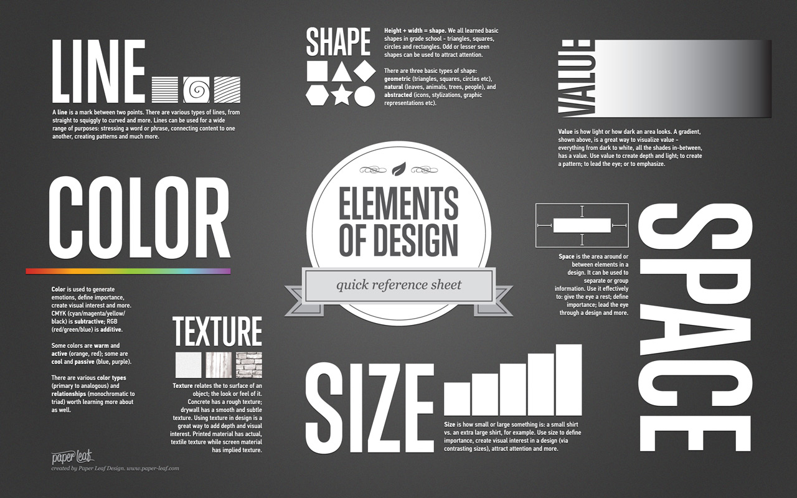
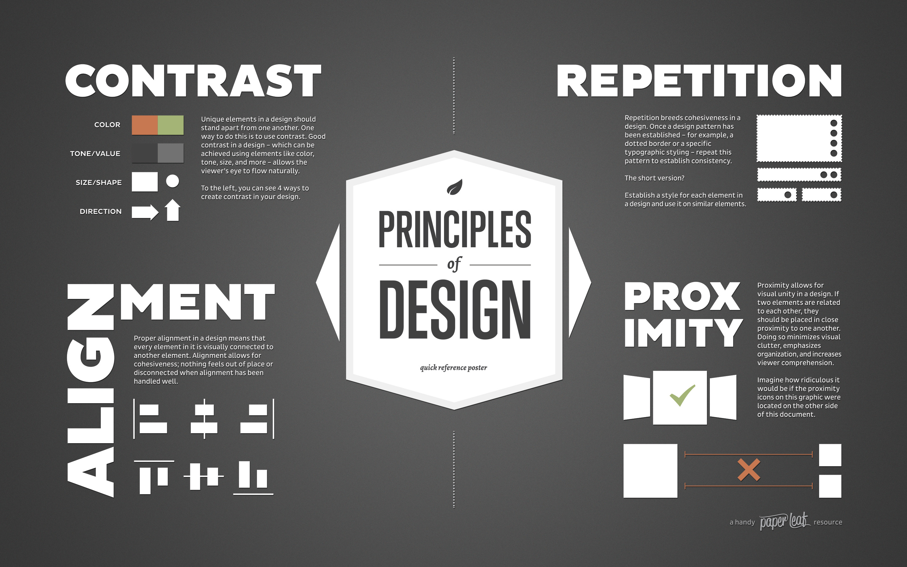

A handout by [Casey Dunn](http://dunnlab.org)

This page can be viewed at https://rawgit.com/Brown-BIOL2430-S04-Fall2015/syllabus/master/data_visualization_handout.nb.html


## What is data visualization?

Data visualization is the mapping of *data attributes* to *aesthetic attributes*.

### Data attributes

Data attributes are direct properties of the data or summaries of the data. *Statistical principals* provide our language for summarizing data. Data attributes can include:

- Magnitude
- Category
- Mean
- Variance
- Median
- Density
- Regression lines

Data visualizations often include both raw data properties (e.g., a scatter plot where magnitude is mapped to position) and data summaries (e.g., a regression line). 

### Aesthetic attributes

Aesthetic attributes are visual properties that can be varied. The *Elements and Principals of Design* provide our language for describing aesthetic attributes. Aesthetic attributes include:

- X position
- Y position
- Color
- Size
- Shape
- Texture
- Motion


Here are a couple figures from [Paper Leaf Design](https://paper-leaf.com/) that summarize these attributes:





## The act of creating a data visualization

When you create a data visualization, you are deciding how to map data to aesthetics. You can use one of the very common mappings, such as a scatter plot or bar chart. If you do this, you can use a canned visualization with default line widths, colors, typefaces, etc, or you can customize it to a greater or lesser degree. These common mappings have the benefit of being familiar to your audience and fitting many goals well. They are often constraining, though, and you should be careful to not misapply them just because they are readily available.

Rather than use a common mapping, you can make your own. This has gotten much easier in the last few years with tools like [d3](https://d3js.org/) and [ggplot](http://tutorials.iq.harvard.edu/R/Rgraphics/Rgraphics.html).

There are several big decisions.

### Should I apply data reduction?

There are a few reasons you may want to reduce data before visualization:

- Not all the data are relevant to the question at hand
- Not all the data are needed to convey the overall point (eg, a reduced number of data elements tells the same story as all the data, but more clearly)
- It isn't technically feasible to show all the data

One way to reduce the data is to exclude particular observations:
- Exclude some observations randomly, eg to rarify the data
- Exclude some observations based on their values, eg exclude data points with large values to focus on what is happening with data points with smaller values. In this sense zooming and cropping is a form of data reduction.

Alternatively, one can exlude or reduce the number of variables:
- You may just be interested in a subset of variables for each observation, and only show those.
- You may ramap higher dimensional data to a lower number of dimensions. For example, PCA rotates the data to show the axes with the greatest variance. Often PCA axes with low variance are then discarded.


### Which aesthetic properties should I map the data to?

A big part of answering this question depends on what the final medium of the visualization is. For example, print is generally more constraining than web. Position, size, and color are typically the easiest attributes to quickly interpret. In general use these before considering other attibutes.

### Should there be auesthetic attributes that are not mapped to data?

Visualizations can also contain easthetic elements that are not mapped to data. These include axes, labels, background images, tic marks, drop shaddows, legends, and a variety of decorations.

The value of these added elements is often overestimated and the cost underestimated. The main cost is distraction. Approach this decision by deciding what is absolutely necessary, and then carefully considering the value of each added item. If there is little or no added value don't add the element. 

## Guiding principals for data visualization

Here is some general advice that applies in post situations:

1. Reduce the number of visual elements that aren't mapped to the data. This corresponds to Tufte's concept of "minimal ink". Axes and labels should be simple. If a visual element doesn't change when the data changes, ask yourself if you really need it.
2. Don't map the same data attribute to multiple aesthetic attributes (eg, size and color of a point). This increases the cognitive load of interpretting the visualization without providing added value.
3. If you are reducing the data, you are essentially looking at a shaddow of the data. Different objects can cast the same shaddow, so there is a stong possibility that you could miss important features of the data. Reduce the data in several different ways to cast a shaddow from different angles to test your assumptions about what you can't see in each particular visualization.

People can get very dogmatic and extreme about data visualization goals, particularly in the paplication of points 1 and 2 above. As with any artform, interesting and productive things can happen when you break the "rules". Just because it is often a bad idea to break the rules doesn't mean it is always bad to break the rules. Here are a couple reasons to break the rules:

- Because it is more beautiful and engaging to do so. Sometimes adding visual elements to a plot that don't map to data will lead to a more compelling and engaging visualization. To paraphrase Jer Thorpe - "I have millions of pixels on my screen, why does every single one need to map to data?"
- Because it enhances a visual metaphore that leads to your visualization being more intuitive and familiar. For example, if your data are latitudes and longitudes, by all means superimpose them on an image of Earth, even though that image doesn't map to data.


## Examples

Simulate a dataset of three varaibles across 100 observations.

```{r}
set.seed(12345)
  # Sigma = matrix(c(matrix(c(10,6,1,6,5,2,1,2,1),3,3)),3,3)
  Sigma = matrix(c(matrix(c(2,-1,0,-1,2,-1,0,-1,2),3,3)),3,3)
  D=data.frame(mvrnorm(n=100, mu=rep(0,3), Sigma))
  names(D)=c("x", "y", "z")
```


Subset the data by plotting only 2 of the 3 variables.

```{r}
  library(ggplot2)

  ggplot(D,
    aes(y=y, x=x)) +
    geom_point()
```

Map all three aesthetic attributes.

```{r}
  library(ggplot2)

  ggplot(D,
    aes(y=y, x=x, col=z)) +
    geom_point()
```


```{r}
  library(ggplot2)

  ggplot(D,
    aes(y=y, x=x, size=z)) +
    geom_point()
```


Map y to multiple aesthetic attributes.

```{r}
  library(ggplot2)

  ggplot(D,
    aes(y=y, x=x, col=y)) +
    geom_point()
```

```{r}
  library(ggplot2)

  ggplot(D,
    aes(y=y, x=x, size=y)) +
    geom_point()
```

```{r}
  library(ggplot2)

  ggplot(D,
    aes(y=y, x=x, size=y, col=y)) +
    geom_point()
```

Add aesthetic attributes that aren't mapped to data.

```{r}

library(png)
library(grid)

img <- readPNG("figures/cat.png")
g <- rasterGrob(img, interpolate=TRUE) 


  ggplot(D,
    aes(y=y, x=x)) +
    geom_point() +
    #facet_grid(.~Place) + 
    theme_bw() +
    annotation_custom(g, xmin=-Inf, xmax=Inf, ymin=-Inf, ymax=Inf)

```